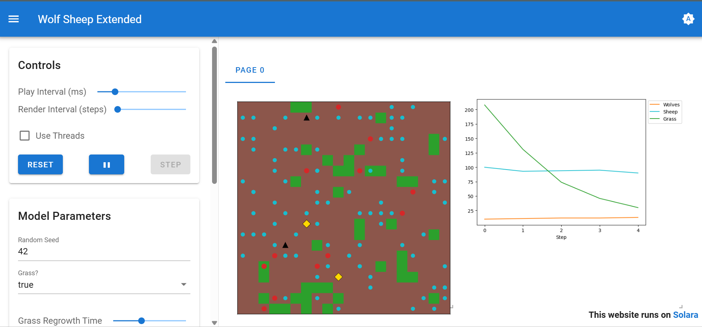

# Wolf–Sheep Simulation (Mesa + Solara)

## Overview

This project extends the classic Wolf–Sheep predator–prey model from the Mesa framework.
Two new agents were added: **Farmer** and **Dog**, which influence the ecosystem and help protect sheep.

The simulation runs in a **web interface using Solara**, allowing users to visualize the grid and adjust parameters.

---

## Agents

### Sheep

* Move randomly
* Eat grass for energy
* Reproduce
* Die when energy reaches zero

### Wolves

* Move randomly
* Hunt sheep for energy
* Reproduce
* Die when energy reaches zero

### Grass

* Sheep eat fully grown grass
* Grass regrows after a number of steps

### Farmer (New Agent)

* Moves randomly across the grid
* 10% chance to regrow grass
* 25% chance to give sheep extra energy
* Can remove wolves from the field

### Dog (New Agent)

* Moves randomly
* Scares wolves
* Scared wolves avoid cells containing sheep

---

## Visualization

Agents appear as:

| Agent  | Display                  |
| ------ | ------------------------ |
| Wolf   | Red circle               |
| Sheep  | Cyan circle              |
| Grass  | Green / Brown background |
| Farmer | Gold diamond             |
| Dog    | Black triangle           |

---

## Requirements

Python Setup Instructions
Install Python 3.13 as 3.14 does not work with PyTorch currently
https://www.python.org/downloads/release/python-31311/ - 64-bit Windows
Installer
Check "Add to PATH" for install otherwise commands below might not work
Open Command Prompt (cmd.exe)
python -m pip install mesa
python -m pip install jupyter
python -m pip install matplotlib
python -m pip install seaborn
python -m pip install networkx
python -m pip install altair
python -m pip install solara

---

## Running the Simulation

Run the simulation using Solara:

```
solara run wolf_sheep.py
```

Then open the browser at:

```
http://localhost:8765
```

---
## Simulation Preview




## Author

Prashik
